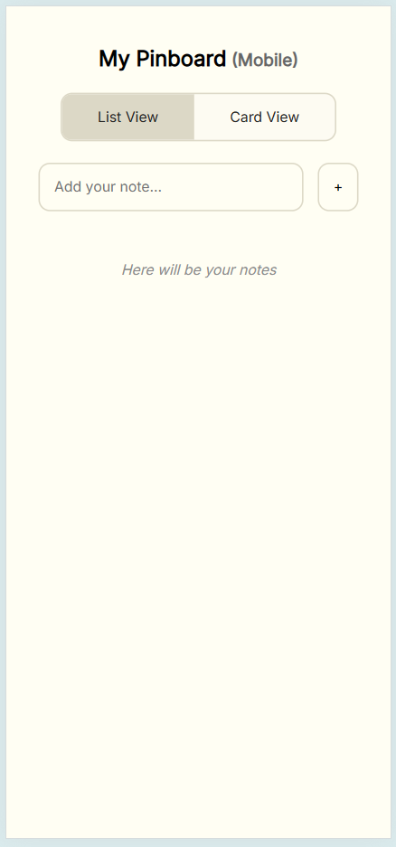
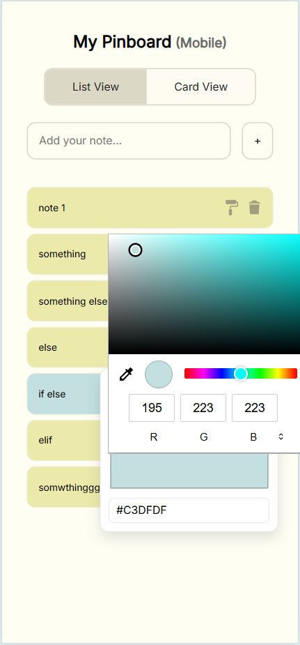
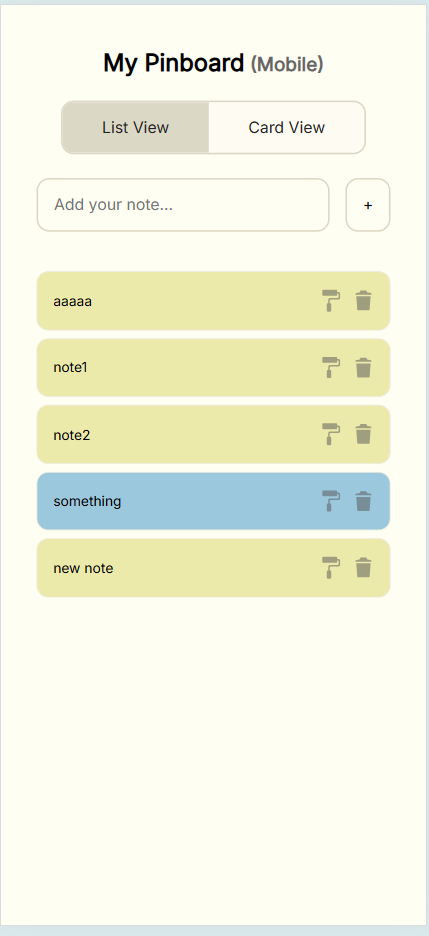
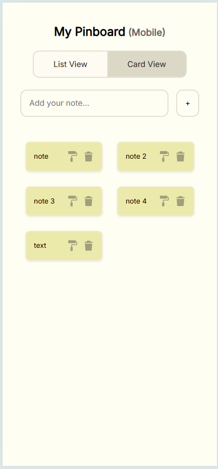

# Assignment  01

## Brief

Starting from the concept of a pinboard, implement a web page that:

- is responsive (properly layout for smartphone, tablet, and desktop)
- allows the user to add and remove elements
- allows the user to coustomize elements (i.e. colors, size)
- allows the switch between two views (at least)

## Screenshots
 
 

 
## Project description

General concept is the pinboard where the user can pin some notes. 
Functionality: user can add and delete notes, change the color of the note. User can switch between 2 views, that have support for Mobile, Tablet and Laptop.  

## Lista funzioni 

1) Adding the note: User can add new note by pressing enter key while focused on the input field, or by pressing "+" button.
2) Deleting the note: user can press the corresponding "trashbin" icon to delete a note. 
3) Changing the color: user can press the corresponding "paint" icon to select a new color for the note.
4) Switch views: user can switch between 2 responsive views that have support for mobile tablet and laptop. 