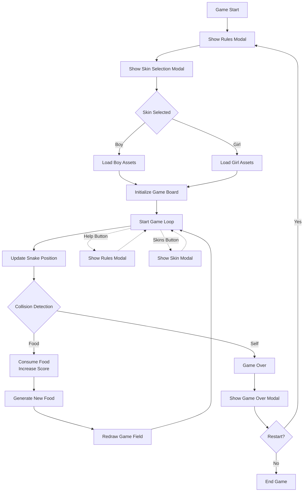

# Brief

Choose a “mini-game” to rebuild with HTML, CSS and JavaScript. The requirements are:

- The webpage should be responsive
- Choose an avatar at the beginning of the game
- Keep track of the score of the player
- Use the keyboard to control the game (indicate what are the controls in the page). You can also use buttons (mouse), but also keyboard.
- Use some multimedia files (audio, video, …)
- Implement an “automatic restart” in the game (that is not done via the refresh of the page)

##Screenshots

##Project Description
##Block diagram

##List of the functions

1) openRulesModal(): Description: displays the rules and controls modal. Pauses game if running. Returns nothing.

2) closeRulesModal(): Description: hides the rules modal and opens the skin selection modal. Returns nothing.

3) openSkinModal(): Description: displays the skin selection modal. Pauses game if running. Returns nothing.

4) closeSkinModal(): Description: hides the skin selection modal and resumes the game if it was running before. Returns nothing.

5) selectSkin(skin): param - skin name ("boy" or "girl"). Description: selects the player's snake skin, updates CSS variables, and redraws the game if active. Returns nothing.

6) updateSkinAssets(): Description: applies the selected skin's head and body image URLs to CSS custom properties. Returns nothing.

7) showGameOverModal(): Description: displays the game over modal with final score and high score. Returns nothing.

8) restartGame(): Description: hides game over modal, resets game state, and shows rules modal for a new game. Returns nothing.

9) generateRandomFoodPosition(headTile, bodyTiles): params - head position and body tiles array. Description: generates a random food position that doesn't collide with the snake. Returns object with row and col.

10) resetGame(): Description: resets all game variables (position, direction, score) and clears the game board. Returns nothing.

11) makeNewFood(): Description: creates a new food tile if one doesn't already exist. Returns nothing.

12) hasColisionWithFood(headTile, foodTile): params - head position and food position. Description: checks if the snake head collides with food. Returns boolean.

13) canChangeDirectionToDesired(potentialPosition, bodyTiles): params - potential head position and body tiles. Description: validates if the desired direction is safe (no self-collision). Returns boolean.

14) consumeFood(oldRow, oldCol): params - previous body segment position. Description: plays sound, adds body segment, updates score, creates new food. Returns nothing.

15) updateSnakePosition(desiredPosition, headTile, bodyTiles): params - desired position, head, and body. Description: moves the snake, handles wrapping, detects collisions with food and self. Returns nothing.

16) redrawGameField(gameTiles2d, headTile, bodyTiles): params - game grid, head position, body positions. Description: updates visual representation of snake and food on the game board. Returns nothing.

17) pauseGame(): Description: stops the game loop by clearing the interval. Returns nothing.

18) startGame(): Description: initializes a new game, generates food, and starts the game loop. Returns nothing.