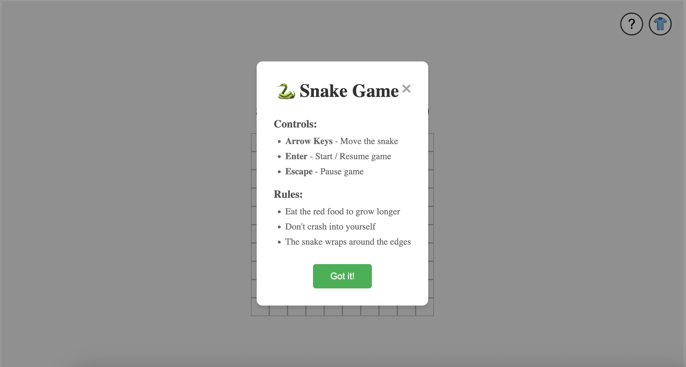
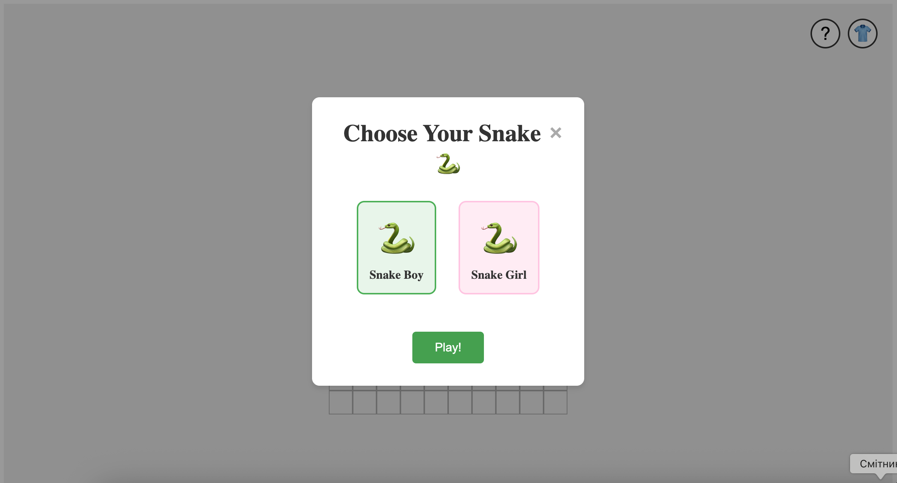
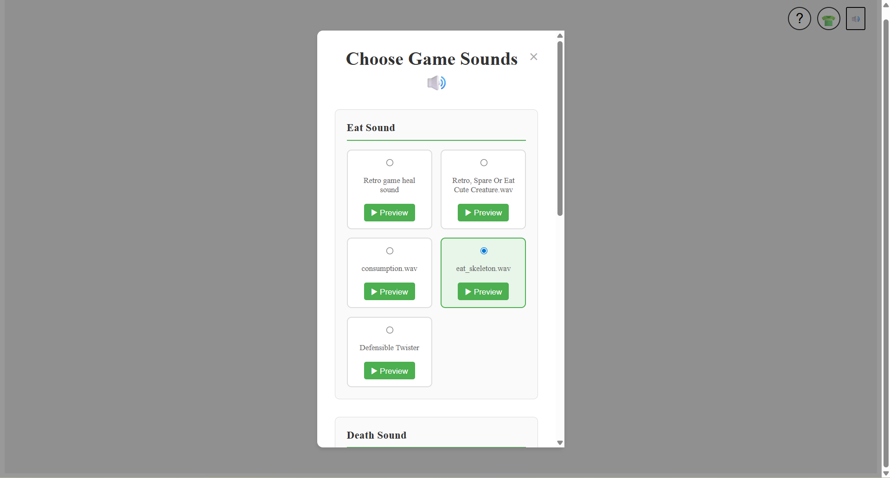
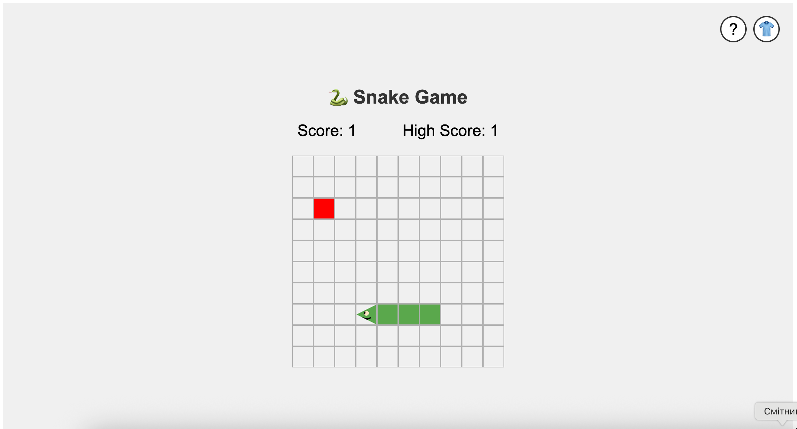
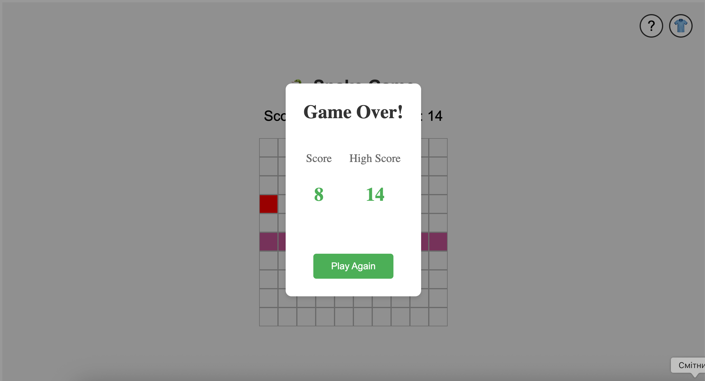
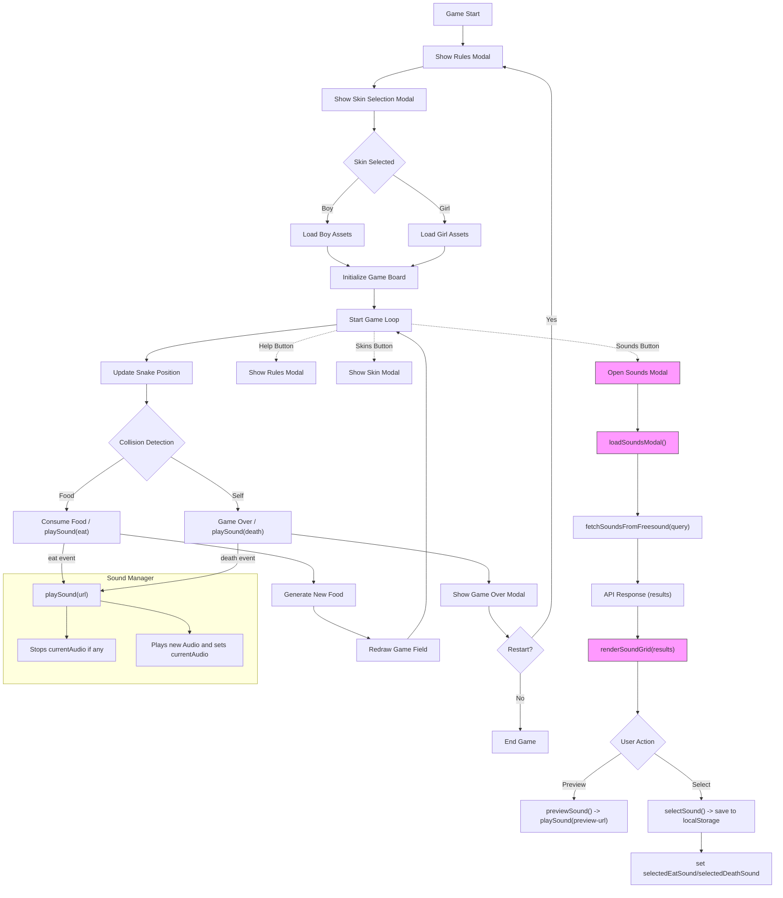

# Brief

The application **must** have those requirements:

- The webpage is responsive
- Use a web API (you choose which one best fists for your project) to load the data and display them in the webpage
- At least one multimedia file (for user feedback interactions, or content itself)
- Develop a navigation system that allows the user to navigate different sections with related content and functionalities

## Screenshots

## Project Description
This is a snake game. Eat food to grow bigger and gain points, game over if hit yourself. You can wrap around edges. Pause, resume game and change skins.   
## Block diagram

##List of the functions

1) openRulesModal(): Description: displays the rules and controls modal. Pauses game if running. Returns nothing.

2) closeRulesModal(): Description: hides the rules modal and opens the skin selection modal. Returns nothing.

3) openSkinModal(): Description: displays the skin selection modal. Pauses game if running. Returns nothing.

4) closeSkinModal(): Description: hides the skin selection modal and resumes the game if it was running before. Returns nothing.

5) selectSkin(skin): param - skin name ("boy" or "girl"). Description: selects the player's snake skin, updates CSS variables, and redraws the game if active. Returns nothing.

6) updateSkinAssets(): Description: applies the selected skin's head and body image URLs to CSS custom properties. Returns nothing.

7) showGameOverModal(): Description: displays the game over modal with final score and high score. Returns nothing.

8) restartGame(): Description: hides game over modal, resets game state, and shows rules modal for a new game. Returns nothing.

9) generateRandomFoodPosition(headTile, bodyTiles): params - head position and body tiles array. Description: generates a random food position that doesn't collide with the snake. Returns object with row and col.

10) resetGame(): Description: resets all game variables (position, direction, score) and clears the game board. Returns nothing.

11) makeNewFood(): Description: creates a new food tile if one doesn't already exist. Returns nothing.

12) hasColisionWithFood(headTile, foodTile): params - head position and food position. Description: checks if the snake head collides with food. Returns boolean.

13) canChangeDirectionToDesired(potentialPosition, bodyTiles): params - potential head position and body tiles. Description: validates if the desired direction is safe (no self-collision). Returns boolean.

14) consumeFood(oldRow, oldCol): params - previous body segment position. Description: plays sound, adds body segment, updates score, creates new food. Returns nothing.

15) updateSnakePosition(desiredPosition, headTile, bodyTiles): params - desired position, head, and body. Description: moves the snake, handles wrapping, detects collisions with food and self. Returns nothing.

16) redrawGameField(gameTiles2d, headTile, bodyTiles): params - game grid, head position, body positions. Description: updates visual representation of snake and food on the game board. Returns nothing.

17) pauseGame(): Description: stops the game loop by clearing the interval. Returns nothing.

18) startGame(): Description: initializes a new game, generates food, and starts the game loop. Returns nothing.

19) fetchSoundsFromFreesound(query): param - search query string. Description: fetches sounds from Freesound API based on the query, returning up to 10 sounds with previews. Returns array of sound objects or empty array on error.

20) loadSoundsModal(): Description: displays the sounds modal and asynchronously fetches eat and death sounds from Freesound API, then renders them for selection. Returns nothing.

21) renderSoundGrid(sounds, gridId, type): params - sounds array, grid element id, and sound type ("eat" or "death"). Description: filters sounds with valid previews and renders them as selectable radio buttons with preview buttons in the specified grid. Returns nothing.

22) selectSound(type, index): params - sound type ("eat" or "death") and sound index. Description: sets the selected sound for the given type, updates UI styling, and saves preferences to localStorage. Returns nothing.

23) previewSound(soundUrl): param - sound file URL. Description: plays a preview of the sound using the sound manager. Returns nothing.

24) openSoundsModal(): Description: opens and loads the sounds modal with Freesound API sounds. Returns nothing.

25) closeSoundsModal(): Description: hides the sounds modal. Returns nothing.

26) playSound(soundUrl): param - sound file URL. Description: central sound manager that stops any currently playing sound and plays the new sound. Ensures only one sound plays at a time. Returns nothing.

## API documentation
https://freesound.org/docs/api/resources_apiv2.html is used in the project for fetching sounds.